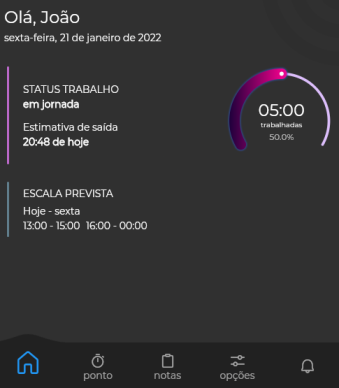
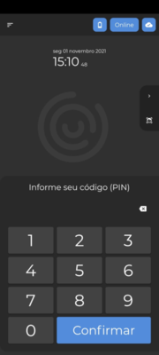

# Novidades da versão

## Flit Web Gestor v4.11.1 (21/02/2024)
 
### 🚀 Novo
 
- `Relatório de absenteísmo [FM-2340]` - Novo relatório de absenteísmo. Neste relatório a empresa poderá verificar se o funcionário trabalhou a quantidade de horas que deveria, sendo assim o absenteísmo leva os valores que ele deixou de fazer, seja por falta ou atraso.
Para gerar este relatório, basta acessar o menu lateral e em seguida relatório. Para efetuar uma exportação, pode-se realizar o filtro por empresa, departamento, cargo ou por usuário. Sendo possível gerar o relatório simples e detalhado (detalhado por dia). Ao salvar em PDF no formato detalhado, será separado dia a dia para sua análise.
 
- `Cadastro da empresa [FM-2160]` - Criado novo recurso nas configurações do cadastro de empresas, para que ao alterar a informação no campo de tolerância e ao salvar, será apresentado uma mensagem perguntando se deseja retroagir esse ajuste, ou seja, para ajustar jornadas que já ocorreram. Ao selecionar uma data, todas as jornadas para frente serão afetadas com a nova tolerância, refazendo assim todos os cálculos das jornadas com base nesta nova informação. Se não deseja afetar jornadas anteriores, basta pressionar o ok sem selecionar a data de aplicação.

- `Exportação  [FM-2455]` -  Criado exportação de ocorrências para os sistemas de folha de pagamento "Fortes Pessoal"  através de arquivo TXT. Consulte no menu lateral em frequência, exportar dados.

### 🌟 Melhorias
 
- `Exportar dados [FM-1735]` - Melhoria na exportação para os sistemas de departamento pessoal. Foi criado o evento "Horas extras na folga". No menu lateral em frequência, exportar dados, acessando o campo modelo poderá editar o modelo de exportação onde é possível configurar incluindo este novo evento. 
 
- `Relatório de Saldos [FM-2292]` - Melhoria no relatório de saldos, foi incluído no relatório uma nova coluna chamada "Horas interjornadas".

- `Realtório de ponto [FM-2342]` - Melhoria interna no relatório de ponto, para que seja possível realizar o filtro selecionando mais de um departamento e cargo para a exportação.

- `Jornada [FM-2530]` - Melhoria interna na aba de jornadas, para quando houver alteração na escala do colaborador,  a jornada que está com o status de pendente não fique como incompleta e sim permaneça com o status anterior. 

- `Integração eContador [FM-2457]` - A partir de agora, ao integrar um afastamento vindo do eContador (plataforma que integra o DP Alterdata com Flit), vai trazer no campo ocorrência  a descrição do afastamento que esta no departamento pessoal. 
 
- `Integração eContador [FM-2541]` - Melhoria na integração com eContador (plataforma que integra o DP Alterdata com Flit). Agora, quando houver exclusão do cadastro do funcionário no DP não será excluído do Flit. Para excluir o cadastro do Flit definitivamente terá que realizar o procedimento manualmente no cadastro do usuário.
 
### 🔧 Correções
 
- `Integração eContador [FM-2130]` - Ajuste interno, agora quando a empresa realizar integração com o eContador (plataforma que integra o DP Alterdata com Flit), o campo da abertura da frequência vai permanecer o mesmo, de acordo com que foi informado no momento do cadastro da empresa. 
 
- `Jornada [FM-2514]` - Ajuste interno no lançamento, para quando houver lançamento de atestado ou abono integral em uma jornada que já tem marcação, este lançamento seja desconsiderado.

- `Auditoria [FM-2448]` - Ajuste interno no filtro por hora na auditoria, para que posso filtrar de acordo com a horário informado.

---

## Flit Web Gestor v4.11.0 (28/12/2023)
 
### 🚀 Novo
 
- `Saldo de banco de horas [FM-2155]` - Nova opção no cadastro de empresas. Agora, será possível configurar em cada empresa, aba parâmetros, se deseja "Exibir  banco de horas no Flit App", ou seja, se o saldo de banco de horas será exibido para o colaborador ou não no aplicativo Flit App. Essa configuração também pode ser feita de forma geral na conta, no menu lateral em outros, parâmetros gerais.  
 
- `Lançamento [FM-2158]` - A partir de agora, será possível incluir qualquer lançamento sem data final. Ou seja, poderá lançar um afastamento e não será necessário inserir a data final, pois entendemos que em alguns afastamentos a empresa não sabe quando o colaborador retornará às atividades. Para os afastamentos que são integrados pelo eContador, também serão integrados sem data final. 

- `Assinatura digital [FM-170]` - Criado novo recurso de assinatura digital no Flit App. Agora será possível enviar o relatório de espelho de ponto para o aplicativo Flit App do colaborador e poderá ser assinado digitalmente por este. 
Através da plataforma de gestão do Flit, na aba relatórios, clicando na opção relatório de ponto e em seguida acessando a opção exportar, será exibido uma outra opção que é: "enviar para o colaborador", com isso, o relatório de ponto será enviado para o aplicativo do funcionário. Também na aba de “relatório de ponto”, através do campo "histórico", será possível acompanhar se o relatório foi enviado, entregue, lido e até mesmo assinado pelo usuário. Vale ressaltar que a assinatura digital do Flit segue o padrão ICP-Brasil, portanto, é válido juridicamente.

- `Importador de AFD [FM-2151]` - Implementado um novo recurso que permitirá importar o AFD de forma automática na plataforma de gestão do Flit. Para baixar o aplicativo, é necessário acessar a plataforma de gestão do Flit, entrar na aba cadastros, cadastros gerais e no final de tela no campo "Dispositivos (Flit Multi e Importador de AFD)". Ao clicar em cadastrar dispositivo, terá o campo “tipo de dispositivo” e ao informar a opção "Importar AFD", selecionar a empresa e informar uma descrição, ao adicionar o novo dispositivo será criado o terminal de importação e em seguida será possível baixar o aplicativo clicando no botão que será exibido. Para acessar o aplicativo baixado, basta inserir o CNPJ da empresa e o PIN gerado pelo sistema. Para conseguir realizar a importação automática, dentro do aplicativo também é necessário selecionar a pasta de rede onde o AFD será salvo pelo relógio de ponto.

- `Integração eContador [FM-2357]` - Quando é realizada a integração com o eContador, terá a opção para que a foto seja atualizada de acordo com o cadastro no DP. Essa opção ficará disponível na plataforma de gestão do Flit na aba outros, integrações, integração Alterdata (eContador). 

- `Usuários [FM-2274]` - Criado novo recurso no cadastro de usuários, para quando alterar a escala do colaborador, ser exibida uma tela onde será possível informar uma data para retroagir a jornada. e a partir da data informada a jornada do colaborador será atualizada. 

- `Dashbord e relatórios [FM-2269]` - Criado um novo recurso que possibilita gerar relatórios e visualizar a empresa no dashboard utilizando como exibição a Razão Social ou nome fantasia. Essa configuração pode ser feita através da plataforma de gestão, aba outros, parâmetros gerais.  

- `Consultar marcação no dispositivo (Flit multi) [FM-2266]` -  A partir de agora, o colaborador poderá consultar sua última marcação de ponto realizada no aplicativo Flit Multi. Para realizar esta consulta, a opção deve ser habilitada pelo gestor na plataforma de gestão em: cadastros gerais, cadastro de dispositivo (Flit Multi), aba parâmetros.  

- `Relatórios - [FM-2169]` - Reformulamos a tela de relatórios. Agora, a aba relatórios é separada por cards, especificando o nome de cada relatório do sistema com um resumo de cada um.

- `Empresa- [FM-1594]` - Foi criado um novo recurso, para quando o endereço da empresa não estiver informado, os gestores serão notificados que o endereço não foi preenchido ou é inválido. Isso se faz necessário, pois de acordo com a portaria 671, o endereço da empresa deve ser preenchido corretamente. 

- `Exportação oficial [FM-1883]` - Na exportação dos arquivos AFD e AFD (Portaria 671), a partir de agora, será possível  exportar o arquivo com o filtro de  departamento e o dispositivo que foi realizada a marcação. 

- `Exportar dados para folha de pagamento [FM-177]` - Criado um novo campo na exportação para folha de pagamento, a partir de agora será possível filtrar por departamento. 

- `Jornada [FM-1315]` - Foi criado um novo campo para que a jornada possa ser criada com a ocorrência de falta ou falta BH (falta que desconta o banco de horas). Essa configuração pode ser feita na aba outros, parâmetros gerais, campo processamento de falta. Algumas empresas quando o funcionário falta, desejam que vá para o banco de horas e não que seja registrada como falta. Esta configuração faz isso de forma automática de acordo com o desejo de cada empresa.

- `Jornada [FM-2114]` - Criado novo recurso no ajuste de jornadas, para sinalizar o gestor ao abrir determinada jornada que a marcação não está disponível ainda dentro desta, informando neste aviso que foi marcado o ponto mas que ainda não está sincronizado na jornada. Pode acontecer de demorar até 10 minutos para a marcação entrar na jornada, então desta forma com o aviso, os gestores não terão a sensação que o funcionário não marcou o ponto.

### 🌟 Melhorias
 
- `Trava do sistema [FM-2329]` - Melhoria interna, agora será possível realizar lançamentos, ajustes de banco de horas e importar AFD com até 60 dias retroativos. 
 
- `Exportação Nasajon [FM -2396]`  - Na exportação para o sistema de folha de pagamento Nasajon, a partir de agora os valores serão separados por ponto e vírgula. 
 
- `Relatórios [2384]` - Melhoria interna no relatório de folha de ponto. A partir de agora, ficará disponível no sistema apenas o novo relatório de folha de ponto, substituindo a folha de ponto antiga, trazendo maior flexibilidade e customizações de acordo com a necessidade de cada empresa.
 
- `Exportar dados para folha de pagamento [FM-2294]` -  Melhoria interna na exportação para folha de pagamento, não será considerada a jornada que foi criada depois da data de desligamento. Inserindo a data de desligamento, a jornada será desconsiderada para exportação. 
 
- `Usuários [FM-2286]` - Criado uma proteção no sistema para quando houver solicitação feita pelo colaborador, o gestor não consiga excluir o cadastro deste funcionário. 
 
- `Exportação NetSpeed [FM-2173]` - Melhoria na exportação para o sistema de folha de pagamento NetSped, agora será habilitado apenas o campo dos eventos que podem ser exportados para esse sistema. 
 
- `Auditoria - [FM-2157]` - A partir de agora, na auditoria vai ser exibido a alteração, inclusão e exclusão que for realizada na aba usuários, banco de horas. 
 
- `Dispositivos (Flit multi) [FM-2154]` - Melhoria interna no cadastro de dispositivos, na aba parâmetros, no campo economia de bateria que será habilitado apenas quando a opção "Permitir marcar ponto com crachá (QR Code)" estiver marcada. 
 
- `Escala - [FM-1882]` - Foi criado novo campo na escala, onde mostra a quantidade de horas trabalhadas por semana.
 
- `Modelo exportação - [FM-2146]` - Reformulamos a tela de modelo de exportação folha de pagamento, para otimizar a tela dos eventos. 
 
### 🔧 Correções
 
- `Cadastro empresa [FM-2381]` - Ajuste interno no campo código externo no cadastro da empresa, para não ocorrer duplicidade no código informado. 
 
- `Integração eContador [2368]` - Ajuste interno, para quando o colaborador for desligado e realizar a integração com o eContador, no Flit vai mudar o status para desligado apenas no dia do desligamento. 
 
- `Jornadas [FM-2283]` - Ajuste interno na jornada para que ao ser criada com a ocorrência de férias, estas sejam verificadas automaticamente. 
 
- `Exportar dados para folha de pagamento [FM-2263]` - Ajuste interno para quando o campo de tipos de eventos estiver com algum evento marcado, nos arquivos gerados serão considerados apenas os eventos  marcados no filtro. 
 
- `Jornadas [FM-2255]` - Ajuste interno na configuração automática de jornadas, para que a jornada seja confirmada de acordo com a configuração feita na aba outros, parâmetros gerais, confirmação automática de jornadas. 

- `Solicitações [FM-2041]` - Ajuste interno na solicitação, para quando o gestor aceitar a solicitação feita pelo usuário, a jornada seja verificada automaticamente. 
 
- `Escala [FM-1732]` - Ajuste interno na escala, realizando uma alteração no cadastro da escala para a jornada ser  atualizada retroativamente, levando a ocorrência correta. 
 
- `Relatório de Saldo [FM-2007]` - Ajuste interno no relatório de saldo, para que dentro do relatório a data do período filtrado seja levada corretamente. 

- `Usuários [FM-1741]` - Ajuste interno no saldo de banco de horas no cadastro do usuário, para quando o colaborador for desligado o saldo de banco de horas considere a última jornada no dia da demissão. 
 
- `Usuário [FM-2048]` - Ajuste interno no cadastro do usuários, para que seja possível incluir uma data retroativa no cadastro do usuário mesmo com a opção de "cargo de confiança" marcada. 

---

## Flit Web Gestor v4.10.0 (31/08/2023)
 
### 🚀 Novo
 
- `Relatório de ponto [FM-1983]` - Reformulamos o antigo relatório de folha de ponto para proporcionar maior eficiência e opções mais abrangentes na geração de dados sobre os turnos de trabalho de seus colaboradores. Isso contribui para um melhor gerenciamento empresarial. Agora estamos chamando de Relatório de ponto, que pode ser gerado o espelho de ponto com padrão da portaria 671, ou podem ser criados novos layouts personalizando entre colunas, cabeçalho e totalizadores. Se os relatórios customizados ficarem sem os campos obrigatórios da portaria 671, ele deixa de se chamar espelho de ponto e vira relatório de ponto.
 
- `Horista [FM-248]` - Implementado a funcionalidade horista, viabilizando o registro de colaboradores atuando nesse regime. Nesse cenário, não se torna obrigatório vincular os colaboradores a uma escala de trabalho. E para configurar é bem simples, basta acessar o cadastro de usuários e na opção de escala, marcar a opção horista. Feito isso, todas as jornadas do colaborador, assim como espelho de ponto, serão tratados com horas trabalhadas e não por escala de trabalho.
 
- `Faixa de hora extra semanal [FM-721]` - Criado novo recurso que possibilita a criação da faixa de hora extra semanal, especificando o percentual de hora extra por dia da semana. Desta forma será possível visualizar no espelho de ponto essas horas extras semanais, bem como exportar para o sistema de folha de pagamento. Após criar essa faixa, basta vincular no cadastro de escala em uma nova aba que foi criada. 

- `Faixa de hora extra diferenciada [FM-245]` - Criado novo recurso que possibilita a criação da faixa de hora extra diferenciada, conseguindo incluir o percentual de hora extra de acordo com a quantidade de horas. Se na sua empresa tem diferenciação de percentual por quantidade de horas, esse é o recurso certo. Desta forma será possível visualizar no espelho de ponto essas horas extras diferenciadas, bem como exportar para o sistema de folha de pagamento. Após criar essa faixa, basta vincular no cadastro de escala em uma nova aba que foi criada
 
- `Espelho de ponto [FM-2063]` - Foi criado novo recurso para os gestores terem a opção de habilitar a exibição do espelho de ponto para os colaboradores que utilizam o Flit App. Se habilitado, será exibido no aplicativo as informações do espelho de ponto.
 
- `Integração eContador [FM-1916]` - Quando é realizado a integração com o eContador (plataforma que integra o DP Alterdata com Flit), agora será apresentado no cadastro do usuário um ícone, exibindo se o cadastro foi realizado no Flit Gestor manualmente ou através da integração com o eContador Alterdata. 
 
- `Exportação NetSpeed/Dexion [FM-1879] [FM-2080]` - Criado exportação de ocorrências para os sistemas de folha de pagamento NetSpeed e Dexion através de arquivo TXT. Consulte no menu lateral em frequência, exportar dados.
 
- `Exportar dados para folha de pagamento [FM-1146]` - Incluído o campo de horas trabalhadas na exportação para o sistema de folha de pagamento, onde são levadas as horas trabalhadas do colaborador.
 
### 🌟 Melhorias 
 
- `Lançamentos [FM-1698]` - Ao lançar abono parcial ou atestado parcial irá mostrar o tempo percorrido.
 
- `Cadastro de empresa [FM-2004]` -Agora não será permitido excluir uma empresa quando houver dispositivo Flit Multi vinculado. 
 
- `Parâmetros gerais [FM-1711]` - Neste recurso  o gestor tem a opção do usuário visualizar ou não o saldo  banco de horas no Flit App. 
 
- `Dispositivo (Flit Multi) [FM-2132]` - Melhoria interna na marcação por QR Code. Agora o gestor pode optar por realizar a marcação por crachá (QR Code) sem tocar na tela no momento da marcação. Para isso, basta marcar a opção “marcação por crachá sem toque”, no cadastro de dispositivos.
 
- `Exportação Prosoft - [FM-2138]` - Na exportação para o sistema de folha de pagamento Prosoft, os valores a partir de agora serão levados em minutos ao invés de horas, compatibilizando com o padrão de importação Prosoft.
 
- `Integração eContador [FM-2044]` - A Partir de agora a integração do eContador (plataforma que integra o DP Alterdata com Flit) é feita automaticamente de 1 hora em 1 hora, dentro do período 06:00 horas às 21:00 horas. Caso precise que a informação chegue de forma rápida no Flit, basta clicar na opção "forçar integração" na aba de integrações.
  
- `Exportação Alterdata [FM-1874]` - Nas exportações para a Alterdata, foi Incluído o campo "Tipo de exportação" onde poderá informar "Folha normal" ou "Folha complementar". 
 
- `Cadastro usuário [FM-1598]` - No cadastro do colaborador, na aba perímetro, a partir de agora não é mais necessário marcar a opção de perímetro padrão.
 
- `Exportação Alterdata [FM-1598]` - Incluído o campo "Mês de referência" na aba exportar dados, para quando a exportação for para o sistema de folha de pagamento Alterdata, seja inserido o período compatível para leitura do arquivo no DP, sem a necessidade de alterar datas manualmente no arquivo. 
 
- `Integração eContador [FM-2119]` - Não enviar os dados do colaborador para Flit Gestor se a empresa não estiver cadastrada pelo eContador (plataforma que integra o DP Alterdata com Flit). 
 
- `Usuários  [FM-1003]` -  Ajuste para não exibir a coluna de reconhecimento facial no cadastro de usuários, para aquelas empresas que não contrataram o reconhecimento facial em seu pacote.
 
- `Ajustes solicitados [FM-2115]` - Ajuste para exibir a quantidade de dias quando houver solicitações de abono e atestado.

### 🔧 Correções

- `Lançamentos  [FM-1623]` - Ajuste interno no lançamento da ocorrência Falta BH, quando lançado abate valores do banco de horas do funcionário.
 
- `Cadastro usuário [FM-2023]` - Ajuste interno para desabilitar a opção "Permitir marcar ponto no navegador web" quando não houver e-mail informado no cadastro do usuário. 
 
- `Solicitações de usuários [FM-2057]` - Ajuste interno para quando é feita a solicitação de marcação, o banco de horas é atualizado de acordo com a solicitação feita. 
 
- `Integração eContador [FM-2093]` -  Ajuste interno, para que a foto do colaborador seja inserida no Flit Gestor, mesmo que esse procedimento seja feito após a primeira integração. 
 
- `Cadastro de usuários [FM-1919]` - Ajuste interno para não permitir excluir o lançamento de banco de horas feito no cadastro do colaborador após a data da trava do sistema (60 dias). 
 
- `Ajustes Jornada [FM-1338]` - Ajuste interno, quando a opção "Cargo de confiança" estiver marcada no cadastro do colaborador e for necessário retroagir a escala, a jornada desse colaborador vai permanecer como "Jornada verificada".
 
- `Relatório de Saldos [FM-2008]` - Ajuste no relatório de saldos, na descrição do campo "Horas trabalhadas no feriado/folga".

- `Relatórios de Saldos acumulados e Usuários [FM-2009] [FM-2010]` -  Ajuste no relatório de saldos acumulados, no formato de data e hora em que os relatórios foram gerados. 

- `Lançamento [FM-2027]` - Ajuste interno,para incluir ocorrência da frequência em todas as jornadas que houverem lançamentos.

- `Importar marcações [FM-1878]` -   Ajuste interno na importação de AFD para que não duplique as jornadas.

- `Escala [FM-2006]` - Ajuste no cadastro de escalas, na descrição do campo "Intervalo pré-assinalado".

- `Relatório Saldos [FM-2088]` - Ajuste interno no relatório de saldos, para que ao filtrar o relatório de saldos mudando a ordem alfabética, o campo total de horas trabalhadas no feriado seja levado corretamente.

---

## Flit Manager v4.9.0 (24/05/2023)

### 🚀 Novo

- `Ajustes solicitados [FM-437]` - Agora, os usuários podem **solicitar ajustes da marcação de ponto por uma interface amigável**, fornecendo detalhes sobre o motivo da solicitação. Estas solicitações são feitas em casos de **esquecimento de marcação, atestados e abonos**. Podendo anexar documentos da galeria ou fotos de um documento no momento da solicitação. Os gestores também recebem notificações automáticas e podem **aprovar ou rejeitar** a solicitação. Promovendo uma comunicação transparente e resolução eficiente de situações com os colaboradores.

---

## Flit Manager 4.8.0 (24/04/2023)

### 🌟 Melhorias

- `Integração e-contador [FM-1887]` - Melhoria na integração do e-contador para que não seja possível fazer duas integrações no mesmo momento.

- `Cadastro de ocorrências [FM-1863]` - Melhoria no cadastro de ocorrências de frequência, para que seja possível cadastrar ocorrências com a mesma descrição de outras que foram excluídas.

- `Relatório de saldos [FM-1853]` - Realizado melhoria no relatório de saldos para exibir uma coluna de atestados.

- `Folha de ponto [FM-1826]` - Agora nas configurações da folha de ponto, será possível escolher se deseja exibir a ocorrência da frequência por tipo ou descrição.

- `Folha de ponto [FM-1823]` - Criado nova configuração na folha de ponto, para a opção de manter a descrição da jornada apenas em uma linha. Sendo bem útil para quem prefere fazer a impressão da folha de ponto do usuário em apenas uma folha.

- `Ajustar jornadas [FM-1819]` - Melhoria interna na duração das jornadas, onde foi aumentada de 24 horas para 72 horas.

- `Exportação Nasajon [FM-1817]` - Agora na exportação da Nasajon tem o campo: "Horas extras intrajornada com redução de hora noturna".

- `Relatório de saldos [FM-1813]` - O relatório de saldos passou a exibir as colunas de horas trabalhadas no feriado e folga.

- `Cadastro de usuários [FM-1790]` - Melhoria feita no campo de matrícula, onde será possível clicar no botão de geração de matrícula e automaticamente será informado uma matrícula aleatória para o usuário. Na aba "Integrações" também foi adicionado um botão para quando chegar um novo cadastro de usuário no Flit Manager, a matrícula já venha preenchida.

- `Integração e-contador [FM-1779]` - Melhoria na integração para que o cargo também passe a ser integrado no cadastro do usuário.

- `Integração e-contador [FM-1776]` - Melhoria na integração para quando acontecer uma transferência entre empresas, o banco de horas do usuário também migre para a nova empresa.

### 🔧 Correções

- `Banco de horas/Ajustar jornadas [FM-1856]` - Ajuste interno na tela de ajuste de jornadas, para exibir a quantidade de banco de horas total quando ultrapassar mais de 3 dígitos, exemplo: 150 Horas.

- `Lançamentos [FM-1837]` - Ajuste interno no comportamento da data final do lançamento.

- `Jornadas [FM-1832]` - Ajuste interno para que as jornadas passem a ser criadas também no dia do desligamento do usuário.

- `Jornadas [FM-1807]` - Ajuste interno para melhorar o comportamento das marcações pré-assinaladas.

- `Comprovante de marcação [FM-1805]` - Ajuste interno no fuso horário do comprovante de marcação, para que sempre leve o fuso horário correto da marcação.

---

## Flit Manager 4.7.0 (02/03/2023)

### 🚀 Novo

- `Endereço prestação de serviço [FM-1473]` - Se adequando à nova portaria 671, agora, existe um campo no endereço do colaborador onde é permitido informar o local da prestação de serviço do mesmo.

- `Exportação AFD [FM-1668]` - Ajuste na exportação do arquivo AFD para ser gerado de acordo com o plano contratado, diferenciando entre REP-A e REP-P conforme portaria.

- `Exportação AEJ [FM-1648]` - Ajuste interno na geração do arquivo AEJ para ser gerado de acordo com o plano contratado, diferenciando entre REP-A e REP-P conforme portaria.

- `Importação AFD [FM-1593]` - Agora também é possível importar marcações para o Flit, utilizando o arquivo AFD com a estrutura da portaria 671.

- `Crachá [FM-1640]` - Agora é possível gerar QR Code, contendo o número de matrícula do funcionário e também imprimir para que o colaborador registre o ponto no Flit Multi, utilizando esse QR Code. Esse recurso deve ser habilitado no cadastro de dispositivo Flit Multi e estará disponível para impressão no cadastro de usuários.

### 🌟 Melhorias

- `Desligamento de usuário [FM-1710]` - Ajuste interno para que mesmo após a data de desligamento do colaborador, tenha jornada incompleta, seja possível desligar o usuário, sem bloqueio.

- `Listagem de marcação [FM-1706]` - Ajuste interno na listagem de marcações, para apresentar o nome do dispositivo onde o colaborador fez a marcação de ponto.

- `Recuperação de senha [FM-1652]` - Ajuste interno no serviço de recuperação de senha.

- `Integração [FM-1652]` - Incluído em acessos a opção para bloquear a tela de integração de um determinado gestor.

### 🔧 Correções

- `Política de privacidade [FM-1704]` - Ajuste interno na política de privacidade.

- `Cadastro de usuários [FM-1754]` - Correção interna para melhorar a ordenação dos usuários por código de matrícula no cadastro de usuários.

---

## Flit Web Manager 4.6.0 (19/01/2023)

### 🚀 Novo

- `Exportações de folha de pagamento [FM-1543]` - Foram unificadas as exportações para sistemas de folha de pagamento, passando todas para o mesmo local: (Frequência > Exportar dados > Exportações para folha de pagamento).

- `Exportação Questor [FM-1539]` - Agora é possível exportar os dados para o sistema de folha de pagamento Questor.

- `Exportações de folha de pagamento [FM-1586]` - Disponibilizamos a possibilidade de exportar a rúbrica "Horas normais" para os sistemas Alterdata, Prosoft, Nasajon e Questor.

### 🌟 Melhorias

- `Marcação [FM-1520]` - Ajuste interno para que os comprovantes de marcação de ponto, levem o HASH e NSR conforme exigido pela portaria 671.

- `Marcação [FM-1545]` - Ajuste interno nos comprovantes de marcação de ponto, para terem a assinatura digital da empresa desenvolvedora do software conforme exigido pela portaria 671.

- `Folha de ponto [FM-1526]` - Ajuste interno na folha de ponto para exibir o CPF do colaborador no cabeçalho.

- `Termo de uso [FM-1583]` - Melhoria para que o termo de uso fique sempre disponível. Com o Flit Manager aberto, ao clicar no canto superior direito, onde fica a foto do gestor, será exibido o "Termo de uso".

- `Política de privacidade [FM-1581]` - Melhoria para que a política de privacidade fique sempre disponível. Com o Flit Manager aberto, ao clicar no canto superior direito, onde fica a foto do gestor, será exibido o "Política de Privacidade".

- `Folha de ponto [FM-1532]` - Ajuste para que seja possível ocultar as observações da folha de ponto. Para fazer isso, basta acessar as configurações da folha de ponto, na aba da folha de ponto.

- `Folha de ponto [FM-1534]` - Ajuste interno para exibir o código de matrícula do colaborador.

- `Relatórios [FM-1536]` - Melhorias de usabilidade foram feitas nos relatórios do sistema.

- `Seleção de datas [FM-1550]` - Ajuste para ser possível digitar as datas do período desejado, sem precisar selecionar pelo calendário.

- `Folha de ponto [FM-1597]` - A folha de ponto foi movida para o agrupamento "Relatórios". O novo caminho é: (Relatórios -> Folha de ponto).

- `Código externo [FM-1602]` - O campo de código externo do departamento foi removido.

- `Importação de AFD [FM-1430]` - Ajuste interno na importação do AFD, em casos onde há usuários cadastrados com o mesmo PIS, um desligado e um ativo, para que respeite sempre o ativo.

### 🔧 Correções

- `Intervalo pré-assinalada [FM-1592]` - Ajuste interno na funcionalidade do intervalo pré-assinalado.

- `Lançamentos [FM-1589]` - Ajuste para que a opção "Válido para todos os colaboradores da empresa" aplique corretamente quando marcada.

---

## Flit Web Manager 4.5.1 (14/12/2022)

### 🚀 Novo

- `Escala [FM-1393]` - Agora é possível definir o regime de compensação horas extras ou banco de horas por dias da semana. Exemplo: de segunda-feira à quinta-feira você pode configurar para trabalhar como **horas extras**, já nos dias sexta-feira, sábado, domingo e feriados como **banco de horas**. Esse recurso você configura diretamente na escala de trabalho.

### 🌟 Melhorias

- `Listagem de marcações [FM-1496]` - Melhoria ao visualizar uma marcação que não possui uma localização definida na listagem de marcações, deixando mais claro que o endereço não foi definido no momento da marcação do ponto.

### 🔧 Correções

- `Folha de ponto [FM-1361]` - Ajuste interno para quando marcar o parâmetro "exibir legenda do tipo dos períodos" na folha de ponto, o sistema efetue uma busca automaticamente ao aplicar a configuração.

- `Lançamentos [FM-1333]` - Ajuste interno na aba "acessos" para que seja possível bloquear o acesso do gestor à tela de lançamentos.

- `Listagem de marcações [FM-966]` - Ajuste interno na listagem de marcações, para que seja possível exportar para Excel a coluna de departamento.

- `Cadastro da empresa [FM-1487]` - Ajuste interno para permitir inserir números no campo "Rua", no cadastro da empresas.

---

## Flit Web Manager 4.5.0 (30/11/2022)

### 🚀 Novo

- `Novo relatório de saldos [FM-1286]` - Implementado relatório de saldos, que tem como objetivo tornar a consulta simples e rápida, das horas extras, atrasos, faltas e muito mais. Consulte em relatórios no menu lateral do Manager.

- `Novo relatório de saldos acumulados [FM-1378]` - Nesse relatório, será possível consultar os saldos acumulados de forma detalhada e rápida, consultando o saldo dia a dia, para horas trabalhadas, banco de horas, horas noturnas, horas extras, entre outros...

- `Integração com o eContador [FM-1380]` - Agora é possível fazer a configuração de integração com o eContador (plataforma que integra o DP Alterdata com Flit), pelo próprio Flit manager, facilitando a integração de usuários, departamentos, cargos, inclusão de férias, desligamentos , entre outros. Basta acessar o menu lateral, ir em Outros e depois em Integrações. Com essa integração habilitada, será necessário apenas cadastrar algumas informações do sistema de Departamento Pessoal Pack Alterdata que serão integrados com o Flit. Apenas escala de trabalho não integrará, deverá esse ser cadastrado no Flit.

- `Arquivo AEJ [FM-1362]` - Agora de acordo com exigências da portaria 671, é possível gerar o novo arquivo fiscal AEJ. Basta clicar em exportações oficiais, em exportar dados que fica na aba frequência do menu lateral do manager.

- `Exportação PROSOFT/NASAJON [FM-1408]` - Criado exportação de ocorrências para os sistemas de folha de pagamento PROSOFT e NASAJON através de arquivo TXT. Consulte no menu lateral em frequência, exportar dados.

### 🔧 Correções

- `Data de admissão [FM-1458]` - Ajuste interno no cadastro de usuários, para quando inserir data de admissão futura e depois ajuste para a data correta, o sistema altere normalmente para a nova informação inserida.

- `Ajuste de jornadas [FM-1452]` - Ajuste interno para que as marcações de ponto entre na jornada correta quando existir marcação pré-assinaladas.

- `Ajuste de jornadas [FM-1418]` - Ajuste interno para que ao ajustar uma jornada de forma manual o tipo mude para "Ajuste manual".

---

## Flit Web Manager 4.4.0 (29/09/2022)

### 🚀 Novo

- `Relatório de usuários [FM-1036]` - Criado novo relatório de usuários, podendo ser exportado em Excel ou PDF de forma simples ou detalhada. Consulte no menu lateral em Relatórios.

- `Auditoria [FM-916]` - Implementado uma nova tela de auditoria. Inicialmente, será possível consultar as alterações feitas nas seguintes telas: Usuários, empresas, parâmetros gerais e feriados. O restante das telas serão adicionadas gradualmente nas próximas versões. Verifique no menu lateral em: Outros > Auditoria.

### 🌟 Melhorias

- `Listagem de marcações [FM-1311]` - Melhoria para que seja exibido a coluna de "Perímetros" no grid da listagem de marcações.

- `Folha de ponto [FM-1280]` - Realizado melhoria na folha de ponto para que seja possível ocultar ou exibir a legenda. Essa configuração está disponível através da tela principal da folha de ponto, ao lado dos filtros.

- `Folha de ponto [FM-1290]` - Inserido nova opção para exibir a coluna de intrajornada na folha de ponto, ou não. Essa configuração está disponível através da tela principal da folha de ponto, ao lado dos filtros.

- `Listagem de usuários [FM-1285]` - Agora é possível filtrar pelo status do colaborador, "Ativos", "Desligados" ou "Todos" em todos os filtros de usuários do sistema.

- `Cadastro de usuários [FM-1283]` - Criado novo recurso para que seja possível realizar alterações cadastrais do usuário de forma retroativa. Ou seja, aplicar uma alteração para jornadas passadas. Para isso clique nos (...) três pontos ao lado do salvar do cadastro de usuários e escolha a data para aplicar as alterações.

### 🔧 Correções

- `Integração Alterdata [FM-1270]` - Ajuste interno quando o feriado cair no domingo e o usuário fizer horas extras, essas horas extras serem levadas no arquivo de integração Alterdata como HE Feriado.

- `Integração Alterdata [FM-1345]` - Ajuste interno na exportação Alterdata, para que as horas extras noturnas também sejam levadas no campo de horas noturnas totais (adicional noturno), independente do regime de compensação da empresa.

- `Integração Alterdata/Dominio [FM-1318]` - Ajuste nos campos de rubricas da Altredata e Domínio, para possibilitar a repetição dos códigos nos campos de horas extras, como exemplo: "Cód. HE seg a sex e Cód. HE sábado" podendo ser utilizados os mesmos códigos em ambos os campos.

- `Banco de horas [FM-1272]` - Ajuste interno no lançamento do banco de horas, para que esse não seja possível lançar a quantidade de horas em branco.

- `Exportação AFDT/ACJEF [FM-1274]` - Ajuste interno na geração dos arquivos oficiais para que seja levado corretamente as marcações com ajuste de ponto manual.

- `Parâmetros gerais [FM-1276]` - Ajuste interno para não permitir inserção de espaços nos campos de "Limite de atraso em minutos" e "Limite de saída em minutos".

- `Cadastro de usuários [FM-1314]` - Ajuste interno ao cadastrar um novo usuário, para que as jornadas do mês sejam criadas de forma retroativa corretamente.

- `Criação de jornadas [FM-1322]` - Modificado a forma de criar jornadas automáticas pelo sistema, para otimizar o tempo de criação.

- `Tela de acessos [FM-1337]` - Novas telas adicionadas na configuração de acesso do gestor: "Lançamentos, relatórios e auditoria". Verifique em menu lateral > Outros > Acessos.

---

## Flit Multi v1.3.3 (21/09/2022)

### 🚀Novo

- `Similaridade Mínima do Reconhecimento Facial [MUL-90]` - Agora é possível configurar a porcentagem da similaridade mínima do Reconhecimento Facial, onde se a similaridade da marcação for menor que o configurado, a marcação não será realizada.  
  A configuração é realizada pelo suporte.

### 🔧 Correções

- `Travamento ao realizar marcações consecutivas [MUL- 89]` - Ajuste interno para que não ocorra travamento ou fechamento do aplicativo, quando é realizada muitas marcações consecutivas.

---

## Flit Web Manager 4.3.0 (23/08/2022)

### 🚀 Novo

- `Cargo de confiança [FM-1110]` - Agora é possível configurar o cargo de confiança no cadastro do colaborador, para que suas marcações sejam preenchidas sem a necessidade de efetuar o registro de ponto. Com isso, a folha de ponto será preenchida de acordo com a escala de trabalho. Para habilitar essa configuração acesse o cadastro de usuários e vá até a aba parâmetros.

- `Intervalo pré-assinalado [FM-1125]` - Agora é possível configurar o intervalo pré-assinalado, onde o usuário precisará executar apenas as marcações de entrada e saída, não sendo necessário marcar o ponto do intervalo. Para habilitar essa configuração acesse o cadastro de escalas. Importante verificar com sua contabilidade ou jurídico se sua empresa pode utilizar esse recurso antes de habilitá-lo.

### 🌟 Melhorias

- `Escalas [FM-1122]` - Agora no cadastro de escala é possível duplica-las.

- `Eventos Alterdata [FM-1194]` - Melhoria nas configurações de integração com a Alterdata, para exibir uma mensagem dizendo que a rubrica não pode ser duplicada.

### 🔧 Correções

- `Listagem de usuários [FM-1193]` - Ajuste interno no filtro para que consiga buscar por reconhecimento facial ativo/inativo.

- `Ajustar jornadas [FM-1187]` - Ajuste interno nos alertas do ajustar jornadas.

- `Cadastro de usuários [FM-1204]` - Ajuste interno para melhorar a ordenação dos usuários.

- `Escalas [FM-1199]` - Ajuste para que usuários demitidos não apareçam na listagem de associar escala.

- `Dashboard [FM-1219]` - Ajuste interno para melhorar a funcionalidade do dashboard.

---

## Flit Web Manager 4.2.2 (29/07/2022)

### 🌟 Melhorias

- `Lançamento simplificado [FM-1112]` - Liberado a possibilidade de ajustar o lançamento mesmo que a data inicial seja superior a 30 dias.

### 🔧 Correções

- `Integração e-contador [FM-1142]` - Ajuste interno na exclusão do lançamento de férias, afastamento e outros quando chegar pelo econtador.

- `Integração e-contador [FM-1099]` - Ajuste interno para quando houver uma transferência de usuário entre empresas, o sistema consiga demitir o usuário correto e admitir o novo usuário que chegou, tudo isso em apenas uma integração.

- `Integração e-contador [FM-1105]` - Ajuste interno para quando o sistema identificar que o novo usuário é fruto de uma transferência entre empresas, o novo usuário herde as informações cadastrais do usuário antigo.

- `Lançamento simplificado [FM-1111]` - Ajuste interno para quando houver exclusão de um lançamento com abono, esse não gere horas negativas.

- `Lançamento simplificado [FM-1150]` - Melhoria no log de verificações para ficar claro quando um lançamento não alterar a jornada.

- `Cadastro de usuários [FM-1163]` - Aumentamos a quantidade de máxima de carácteres no campo de e-mail do usuário.

- `Ajustar jornadas [FM-1089]` - Ajuste interno no cálculo das horas quando há redução de horas noturnas.

- `Ajustar jornadas [FM-969]` - Ajuste feito para quando houver redução de horas noturnas, fique padronizado mostrando a mesma quantidade de horas no campo de escala prevista e realizada.

- `Integração e-contador [FM-1153]` - Agora quando é importado um lançamento do e-contador com período muito longo, o mesmo é fracionado de 6 em 6 meses.

---

## Flit Web Manager 4.2.1 (13/07/2022)

### 🔧 Correções

- `Ajuste de jornadas [FM-1050]` - Ajuste interno para voltar a confirmar as jornadas automaticamente de acordo com as configurações.

- `Lançamento simplificado [FM-1039]` - Ajuste interno para melhorar o lançamento retroativo de férias.

- `Lançamento simplificado [FM-1044]` - Ajuste interno no status programado do usuário para que fique com o status correto.

- `Lançamento simplificado [FM-1056]` - Ajuste interno na data final do lançamento simplificado para auto preencher de acordo com a data inicial informada.

- `Folha de ponto [FM-1072]` - Ajuste interno para que o totalizador de horas acumuladas apareça na impressão.

- `Feriado [FM-997]` - Ajuste interno na configuração de feriado para que aplique nas empresas corretas.

- `Reconhecimento facial [FM-1094]` - Ajuste interno para deixar de contar o reconhecimento facial em usuários desligados.

---

## Flit Web Manager 4.2.0 (30/06/2022)

### 🚀 Novo

- `Busca/Pesquisa [FM-793]` - Habilitamos um campo de busca nos filtros da plataforma, para permitir pesquisar funcionários, departamentos, cargos e empresas, apenas digitando a descrição de cada.

- `Lançamento simplificado [FM-739]` - Criado novo recurso para ser possível efetuar lançamentos em bloco, onde o gestor conseguirá por exemplo, lançar um atestado para vários dias de uma única vez e ainda para vários funcionários, assim como, afastamento, férias, abonos. Inclusive é possível efetuar abonos parciais, quando o funcionário se ausenta por um período da empresa, mas será abonado e não descontado pela ausência.

- `Status do usuário [FM-726]` - Agora o status do usuário será modificado apenas pela tela de Lançamentos, alterando para férias, afastado e contrato suspenso. Antes poderia ser modificado no cadastro de usuários, mas agora ficou pela tela de lançamentos.

- `Comprovante de ponto [FM-725]` - Criado nova tela para consulta do comprovante de ponto. O colaborador pode consultar através de um navegador, mesmo pelo celular, o seguinte link: <https://comprovante.flitapp.com.br/#/login>.

- `Listagem de usuários [FM-857]` - Criado filtro no cadastro de usuários, para que na listagem exiba apenas os ativos. Caso queira analisar os desligados, pode-se utilizar o filtro para a pesquisa.

- `Listagem de usuários [FM-856]` - Criado no cadastro de usuários um ícone ao lado do contador de usuários ativos, exibindo que na contagem de licenças não conta com os usuários desligados.

- `Listagem de marcação [FM-777]` - Adicionado CNPJ ao lado do nome fantasia em todas as buscas de empresas na plataforma.

- `Ajustar jornadas [FM-779]` - Criado nova opção no ajuste de jornadas para permitir visualizar e selecionar tipo do período.

- `Filtros [FM-913]` - Ajuste interno em todos os filtros, para ser possível remover apenas um filtro selecionado na hora de pesquisar.

### 🌟 Melhorias

- `Parâmetros gerais [FM-844]` - Melhoria interna na exibição dos parâmetros para quem utiliza a plataforma no pacote único (apenas marcação de ponto).

- `Importação AFD [FM-865]` - Ajuste interno no tempo de resposta na importação do arquivo AFD.

- `Folha de ponto [FM-752]` - Ajuste interno para que a folha de ponto seja exibida de forma mais ampla na tela de visualização.

- `Cadastro de escalas [FM-770]` - Melhoria para que o gestor consiga alterar a escala e informar a partir de qual data deseja aplicar essa nova escala no funcionário.

### 🔧 Correções

- `Hora extra [FM-943]` - Ajuste interno para que as horas extras noturnas do ajustar jornadas apareça corretamente no resumo da jornada.

- `Ajustar jornadas [FM-873]` - Ajuste interno para que não exiba usuários indevidos para o gestor no ajustar jornadas.

- `E-mail de boas-vindas [FM-920]` - Ajuste interno no e-mail de boas-vindas.

---

## Flit App 4.6.1 (17/05/2022)

### 🌟 Melhorias

- `Melhoria na ressincronização das marcações [FA-168]` - Ajuste interno para ressincronizações das marcações off-line.

### 🔧 Correções

- `Gráfico de horas trabalhadas [FA-157]` - Foi otimizado o tempo do primeiro processamento do gráfico de horas.

- `Login/ Recuperação de senha [FA-156]` - Ajuste interno para quando usuário inserir o e-mail através do preenchimento automático, não apareça a mensagem de “usuário inválido”.

- `Marcação [FA-167]` - Ajuste interno para quando o Gestor estiver realizando alterações cadastrais e o usuário estiver marcando ponto, a marcação ocorra normalmente.

---

## Flit App 4.6.0 (22/04/2022)

### 🌟 Melhorias

- `Login [FA-104]` - Adicionado proteção para quando ocorrer bloqueio de conexão, o aplicativo informe que se trata de um bloqueio de rede.

- `Reconhecimento facial [FA-114]` - Ajuste interno para quando utilizar o reconhecimento facial, o sistema identifique o usuário de acordo com a empresa vinculada.

- `E-mail de boas-vindas [FA-117]` - Melhoria na cor do e-mail de boas-vindas e no primeiros a passos.

- `Comprovante [FA-125]` - Agora o comprovante da marcação de ponto, apresenta a origem do registro, ou seja, qual aplicativo foi utilizado.

- `Marcação por exceção [FA-127]` - Ajuste interno nas marcações por exceção, para que sejam feitas apenas com o horário original do servidor.

- `Notas [FA-129]` - Adicionado nova forma de visualização/edição de notas na aplicativo web.

- `Notificações [FA-128]` - Adicionado notificações de exceções no aplicativo web.

- `Menu lateral [FA-130]` - Criado menu lateral para o aplicativo web.

- `Recuperação de acesso [FA-143]` - Melhoria para quando o usuário não lembrar o e-mail cadastrado, poderá recuperar a senha utilizando o CPF.

### 🔧 Correções

- `Gráfico de horas trabalhadas [FA-117]` - Ajuste interno na exibição das informações, para ficarem alinhadas.

- `Cadastro de feriado [FA-119]` - Ajuste interno no percentual do gráfico para que mostre corretamente quando há horas extras.

- `Seleção de horário [FA-140]` - Ajuste visual na seleção de horários das exceções.

- `Gráfico de horas trabalhadas [FA-135]` - Ajuste interno para quando a jornada for folga, férias ou qualquer outra que não tenha período previsto de trabalho o gráfico ficará oculto.

---

## Flit Web 4.1.2 (19/04/2022)

### 🔧 Correções

- `Proteção marcação sem foto [FW-10]` - Ajuste interno para permitir marcar o ponto sem foto, apenas se a opção "Fotografar colaborador ao marcar ponto no Flit Web" estiver desmarcada no cadastro de empresas da plataforma de gestão.

---

## Flit Manager 4.1.1 (08/03/2022)

### 🚀 Novo

- `Layout [FM-820]` - Foi criada uma opção na aba superior direita onde mostrará os links dos aplicativos e também as recomendações mínimas/recomendadas.

### 🌟 Melhorias

- `Página inicial do blog [FM-799]` - Ajuste interno na aba "início" para exibir as novidades da versão.

- `Cadastro de empresas [FM-836]` - Ajuste interno para permitir inserir até 200 caracteres nos campos de razão social e nome fantasia.

- `Cadastro de usuários [FM-802]` - Realizada melhoria para que usuários cadastrados já como demitidos tenham suas jornadas recentes criadas.

- `E-mail de boas-vindas [FM-860]` - A cor do e-mail de boas-vindas foi alterada e o passo a passo também foi melhorado.

- `Mapas [FM-800]` - Realizada melhoria nos mapas do Flit. Agora também mostrará os negócios locais e pontos de referência.

- `Cadastro de feriado [FM-795]` - Ajuste interno na opção "Válido para todas as empresas do município/estado”, para ser habilitada somente após a seleção do município/estado.

- `Listagem de marcações [FM-810]` - Agora a foto do colaborador se adapta de acordo com o tamanho da câmera na área de identificação da marcação e quando passa o mouse sobre fica possível expandir.

### 🔧 Correções

- `Parâmetros gerais [FM-844]` - Ajuste interno para quando utilizar o Flit apenas como marcação de ponto, as opções de parâmetros gerais sejam bloqueadas.

- `Cadastro de feriado [FM-833]` - Ajuste interno na mensagem que aparece ao criar um feriado já existente.

- `Cadastro de usuários [FM-848]` - Ajuste interno na hora de cadastrar usuários sem categoria.

- `Cadastro de feriados [FM-798]` - Ajuste interno na escrita do modal de informações do feriado.

---

## Flit Manager 4.1.0 (24/02/2022)

### 🚀 Novo

- `Interface nova [FM-592]` - A interface principal do manager está de cara nova! :)

### 🌟 Melhorias

- `Cadastro de feriados [FM-705]` - Criado novo cadastro de feriados, no qual será possível selecionar se o feriado é nacional, estadual ou municipal separando por empresas.

- `Feriados nacionais [FM-658/703]` - Os feriados nacionais serão adicionados automaticamente todos os anos pela equipe Flit.

- `Cadastro de feriados [FM-696]` - Ajuste interno para quando um feriado for cadastrado na data atual ou posterior, as jornadas anteriores serem atualizadas e recalculadas com base nas empresas afetadas. Exemplo: Se hoje é dia 24/02 e o feriado aconteceu dia 20/02 e esse não estava cadastrado antes, ao cadastrar esse feriado no sistema, o Flit Manager vai atribuir nas jornadas do dia 20/02 feriado para todos da(s) empresa(s).

- `Exportação MOV.DP [FM-717]` - Ajuste interno na exportação MOV.DP para que os campos de HE Seg. a Sáb. e Feriado/Domingo fiquem separados.

- `Envio de e-mails [FM-579]` - Melhoria interna no layout do envio de e-mail de marcações, recuperação de senha. O usuário também receberá um e-mail de ativação/recuperação assim que o gestor cadastrá-lo no manager.

### 🔧 Correções

- `Integração Alterdata [FM-619]` - Ajuste visual nos campos de integração com a Alterdata em parâmetros gerais.

- `Marcação ignorada [FM-597]` - Ajuste interno para que a marcação de ponto seja ignorada apenas para aquelas realizadas no mesmo minuto.

- `Reconhecimento facial [FM-598]` - Ajuste interno para quando o usuário estiver com a opção "utiliza reconhecimento facial" marcada e ao desligá-lo, o sistema desmarque automaticamente essa opção.

- `Endereço (Usuários/Empresas) [FM-561]` - Ajuste interno nos campos de endereço para que seja possível cadastrar o número como "S/N".

- `Ajustar jornadas [FM-699]` - Ajuste interno no cálculo da jornada, para quando editar a saída do primeiro período.

---

## Flit Manager 4.0.12 (24/01/2022)

### 🌟 Melhorias

- `Folha de ponto [FM-682]` - Otimização na geração da folha de ponto.

- `Processamento de jornadas [FM-653]` - Ajuste interno no processamento de jornadas para ignorar as jornadas antigas que ficam em memória.

### 🔧 Correções

- `Status do usuário [FM-682]` - Quando o usuário estiver de **férias, afastado ou suspensão de contrato**, o status somente voltará para **ativo de forma automática** quando a data final for menor que a data atual.

---

## Flit App 4.5.0 (21/01/2022)

### 🌟 Melhorias

- `Escala prevista [FA-77]` - Realizada melhoria na tela principal do aplicativo para exibir a escala prevista do funcionário para o dia atual.

- `Previsão de saída [FA-79]` - Na tela principal também será mostrada a previsão de saída do funcionário caso tenha marcação na jornada atual.

  

### 🔧 Correções

- `Status do usuário [FA-75]` - Agora quando o usuário estiver com um status de: Férias, afastamento ou suspensão de contrato configurado para uma data futura, ele conseguirá marcar o ponto, bloqueando a marcação só durante o período do afastamento.

---

## Flit Multi 1.2.1 (25/11/2021)

### 🔧 Correções

- `Configuração - Câmera [MUL-22]` - Botão de voltar na configuração da câmera está mais visível.

- `Login [MUL-21]` - Ao colocar um terminal inválido na hora de fazer o login, aparecerá uma mensagem de falha na tela.

- `Logout [MUL-42]` - Quando houver um logout automático aparecerá na tela em qual dispositivo ocorreu o novo acesso.

---

## Flit Web Manager 4.0.11 (25/11/2021)

### 🚀 Novo

- `Listagem de marcação [FM-540]` - Foi criada uma nova coluna que mostra os dias da semana na listagem de marcação.

- `Listagem de marcação [FM-511]` - Foi criada uma nova coluna que mostra a hora da marcação do usuário.

- `Exportação MOV.DP [FM-405]` - Agora é possível fazer a exportação das horas extras intrajornada no arquivo, o campo fica na aba de "Parâmetros gerais".

### 🌟 Melhorias

- `Reconhecimento facial [FM-532]` - Proteção para que só seja possível subir imagens que tenham um rosto identificado. Caso o reconhecimento facial obrigatório esteja marcado.

- `Proteção para a exceção [FM-551]` - Caso o usuário tenha feito marcação por exceção alguma vez, o gestor não conseguirá excluir o cadastro do mesmo.

### 🔧 Correções

- `Criação de jornadas [FM-504]` - Antes, quando fazíamos a criação interna de jornadas em massa e o usuário possuía marcação de um dia para o outro, algumas jornadas não eram criadas e isso foi corrigido.

- `Recálculo de acumulados [FM-509]` - As jornadas vão permanecer com a configuração de horário noturno do momento da criação da jornada. Caso o usuário queira atualizar as configurações de redução de horário noturno terá que acessar a jornada e clicar no botão de "Atualizar" que só aparecerá caso a configuração da jornada esteja diferente da conta.

- `Criação de jornadas [FM-509]` - Jornadas só serão criadas após a data de admissão do usuário.

- `Jornada de usuário demitido [FM-537]` - As jornadas devem ser criadas até a data de demissão do usuário.

- `Horas noturnas [FM-522]` - Ajuste feito para que a redução de hora noturna calcule da mesma forma na jornada prevista e na jornada realizada.

---

## Flit Web Manager 4.0.10 (29/10/2021)

### 🌟 Melhorias

- `Listagem de marcações [FM-443]` - Adicionado campo de **matrícula (PIN)** do usuário, levando também essa informação na exportação para Planilha (Excel).

- `Banner topo [FM-432]` - Criado recurso para quando o cliente estiver inadimplente, exibir um banner em vermelho com um contador de dias que faltam para que o sistema seja bloqueado (prazo de 5 dias). Dessa forma não será bloqueado de imediato quando entrar em inadimplência.

### 🔧 Correções

- `Empresas x Jornadas [FM-445]` - Ajuste interno para não permitir a exclusão de empresas que possuem marcações, jornadas ou usuários.

- `Hora noturna [FM-447]` - Ajuste interno no cálculo de jornadas para quando as horas extras estiverem dentro da tolerância, serem descontadas apenas da jornada horas diurnas.

- `Dashboard [FM-464]` - Ajuste interno para exibir status correto do usuário no Dashboard, depois de marcar o ponto estando com um atraso.

- `Cadastro de usuários [FM-467]` - Ajuste interno para não remover o perímetro do usuário após alterar qualquer informação no seu cadastro.

---

## Flit Multi 1.2.0 (27/10/2021)

### 🌟 Melhorias

- `Nova orientação vertical [MUL-18]` - Agora é possível utilizar a marcação de ponto no Flit Multi na forma vertical do dispositivo.

  

---

## Flit Web Manager 4.0.9 (11/10/2021)

### 🚀 Novo

- `Cadastro de (Usuários/Perímetros) [FM-373]` - Agora é possível **vincular até 5 perímetros** diferentes no cadastro de usuários, desta forma o usuário não fica limitado a marcar apenas em um único perímetro.

- `Cadastro de empresas [FM-374]` - Na aba parâmetros foi criado uma opção para **permitir marcar ponto fora do perímetro** caso o dispositivo não consiga obter a localização e tenha passado de 30 segundos na com a tela de marcação aberta.

- `Cadastro de empresas [FM-108]` - Também na aba parâmetros será possível **informar até 5 IPS externos, para restringir as marcações do flit web**, desta forma, caso o gestor opte por utilizar este recurso ele pode ter o controle se o usuário está marcando ponto por dentro da rede da empresa por exemplo, caso esteja fora da rede não permitirá a marcação.

- `Exportação Alterdata [FM-400]` - Em parâmetros gerais foi **criado o campo de horas noturnas totais**, também é possível exportar o mesmo na tela de exportações.

### 🌟 Melhorias

- `Cadastro de usuários [FM-360]` - Os códigos externos do domínio agora são validados se são únicos por empresa e não por conta.

- `Cadastro de usuários [FM-375]` - Não permitir excluir usuários que já realizaram marcações em qualquer um dos apps.

- `Ajuste de jornadas [FM-392]` - Inserido log de exclusão manual de período.

- `Ajuste de jornadas [FM-376]` - Ocultar jornadas após a data de demissão dos usuários.

- `Cadastro de dispositivos [FM-363]` - Melhorias de UI e UX, a fonte do PIN foi melhorada para não confundir as letras minúsculas com maiúsculas, e também agora o CPF/CNPJ da empresa fica perto do PIN no modal de detalhes do dispositivo para facilitar a inserção de dados no formulário de login.

### 🔧 Correções

- `Folha de ponto [FM-365]` - Períodos trabalhados consideravam o fuso do local do navegador, agora assim como no ajuste de jornadas consideram o fuso do período que está no servidor para exibir os horários.

- `Folha de ponto [FM-357]` - Antes eram geradas duas páginas de folha de ponto quando o colaborador fazia aniversário naquele mês, agora é gerada apenas uma como esperado.

- `Ajuste de jornadas [FM-358]` - Ao abrir a jornada de um usuário que foi excluído, ela ficava carregando em loop e não abria.

- `Ajuste de jornadas [FM-413]` - Ao atualizar a escala na jornada de um usuário que foi importado e está sem escala, ele joga como folga, antes ficava carregando em loop.

- `Criação de jornadas [FM-417]` - Ao editar o cadastro do usuário em cenários que era necessário criar as jornadas daquele período em aberto, as marcações já realizadas anteriormente não eram inseridas na jornada.

---
